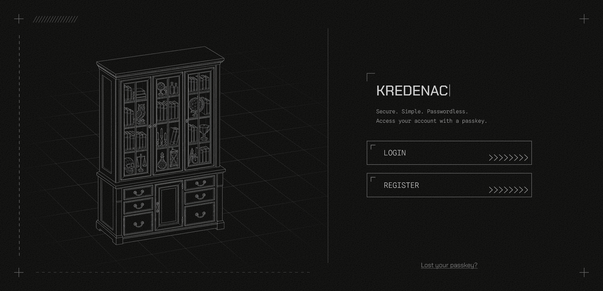

# Kredenac frontend

Kredenac is an online cabinet for all your notes and files. You unlock it with a passkey, and your email is how you get one: a magic link registers your first passkey, or a new one if you lose it. This is the web client for [kredenac.moma.rs](https://kredenac.moma.rs): the pages you sign in through, keep your notes in, and drop your files into. It is a light frameworkless single-page app in plain HTML, TypeScript and SCSS built using Vite.

## Screenshot



## Pages

| Route | Page | What happens there |
| --- | --- | --- |
| `/` | `login` | passkey sign-in, with an email field that expands in place for registration or recovery |
| `/verify/:token` | `verify` | landing page of the magic link: creates the passkey and finishes registration |
| `/` (signed in) | `home` | notes, plus files with drag-and-drop upload for Privezak sessions |
| `/settings` | `settings` | list, add and remove passkeys, or delete the account |

The Files tab and the drop zone exist only when the session token carries `pzk`, which the
backend sets for passkeys attested as Privezak-made. Everyone else sees notes alone, and the
layout re-centres around the one column.

## How the code is organised

```
src/
├── main.ts               route table, session-expiry dialog, initial silent refresh
├── pages/<page>/         one folder per page: page.ts + page.html + page.scss (+ subparts)
├── components/           button, dialog, nav, icon, message-hint, scroll-list, decorations
├── lib/
│   ├── render/dom.ts     h(), template(), ref(), mount(): the whole "framework"
│   ├── state/router.ts   history-based router with :params and a back interceptor
│   ├── http/api.ts       every backend call, cookie session handling, CSRF, silent refresh
│   ├── http/session.ts   in-memory session state (CSRF token, privezak flag)
│   ├── webauthn/         navigator.credentials wrappers, base64url, Signal API
│   └── strings/          user-facing messages and formatting
├── styles/               shared SCSS: constants, mixins, base, app shell
└── types.ts              DTOs shared with the backend
```

A page is a function that returns a `Node`. Its markup is an `.html` file imported with
`?raw` and parsed once by `template()`. Elements the code needs are tagged with `data-ref`
and looked up with `ref()`. Dynamic children are built with `h()`, which refuses
`innerHTML`-style attributes and strips `javascript:` URLs, so there is no path for markup
injection short of deliberately going around it.

Layout switches at 900px (`$breakpoint-desktop`, mirrored in `lib/render/breakpoint.ts`):
top and bottom navigation bars, message placement and a few dialog frames differ between
the two.

## Sessions and the API

`lib/http/api.ts` is the only file that talks to the server, always under `/api`:

- The access token is an `HttpOnly` cookie the browser sends on its own. The CSRF token comes
  back in the login/refresh response and is attached as `X-CSRF-Token` on every non-GET
  request.
- Access tokens are short-lived. The client schedules a refresh shortly before expiry, and
  also retries once after a 401 by refreshing first. Concurrent refreshes share a single
  in-flight promise, because the server treats a second use of the same refresh token as
  theft and revokes the whole chain.
- If a refresh fails, the session is cleared and `kredenac:session-expired` is dispatched;
  `main.ts` turns that into the "signed out" dialog.
- Uploads go through `XMLHttpRequest` for progress events. The multipart body must send
  `size` **before** `file`: the server reads the declared size as parts stream past and
  has no lookahead. `FormData` preserves insertion order, so keep those two lines in order.

`lib/webauthn/webauthn.ts` asks for `attestation: "direct"`. That is what lets the backend
see Privezak's attestation chain. With `"none"` the browser strips it and every passkey
looks the same. After a rejected assertion the client reports the credential through the
WebAuthn Signal API so a passkey manager can drop it. The settings page likewise signals the
accepted list and current user details after changes.

## Development

```bash
npm ci
npm run dev
```

`vite.config.ts` serves over HTTPS when `../certs/backend.crt` exists, proxies `/api` to
`https://localhost:8080`, and sets the same security headers the backend sends in
production, so the CSP is exercised during development too. `allowedHosts` includes the
production hostname so a Cloudflare tunnel can be pointed at the dev server when debugging
against real passkeys (the RP ID has to match). `npm run dev:preview` is a plain-HTTP
variant on port 5174 with the same proxy.

```bash
npm run build      # tsc + vite build → dist/
npm test           # vitest, unit tests under src/lib/tests
```

In production the backend serves `dist/` itself from `FRONTEND_DIST_PATH`. The Docker build
in the parent directory runs `npm run build` and copies the result into the server image.

Fonts (Chakra Petch, Spline Sans Mono) load from Google Fonts and are the only external
resource, and the CSP allows exactly those two origins.
