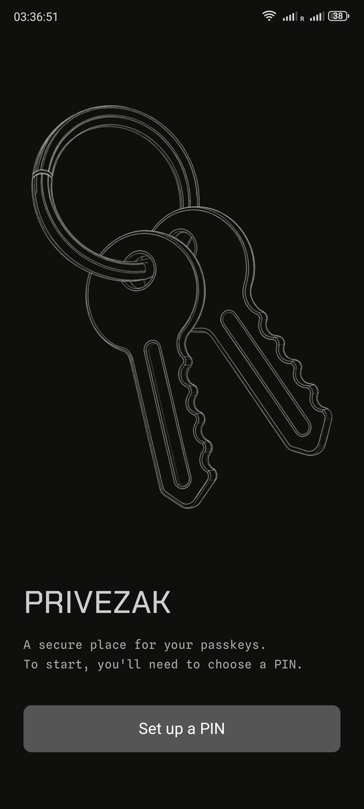
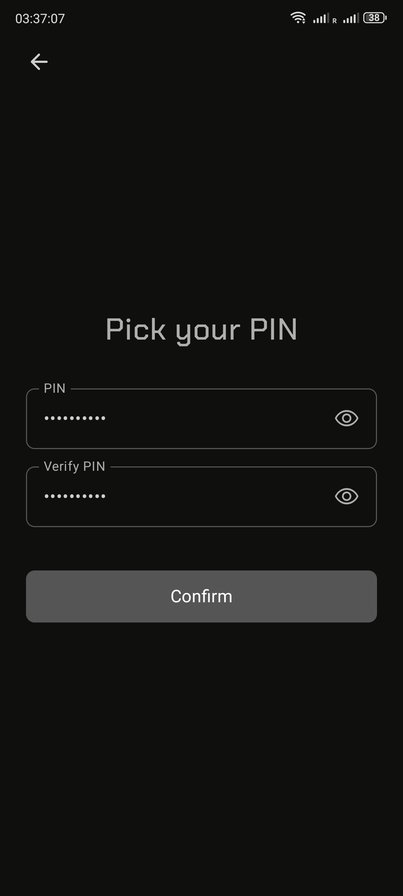
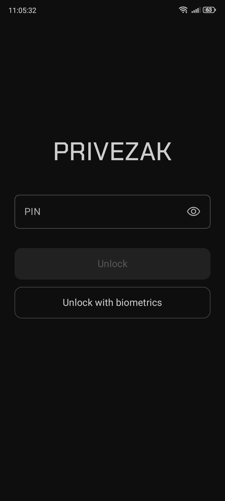
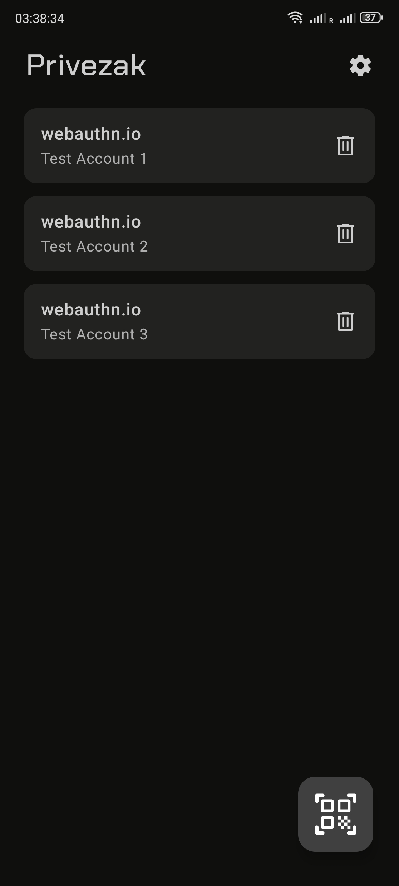
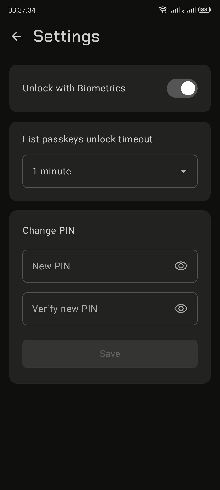

# Privezak

Privezak is a keychain for your passkeys. It is an Android passkey manager that gives you an
easy and secure way to create passkeys and sign in with them to your favourite websites and
apps. It plugs into Android's Credential Manager the same way Google Password Manager does,
but unlike Google it stores passkeys strictly locally. The private half of every passkey is
kept in the phone's trusted execution environment, or in StrongBox where the device has one,
which means hardware-backed protection and, just as usefully, an attestation to prove it.

Privezak is one side of the coin, the other side is [kredenac](../kredenac), a web storage app.
Kredenac can cryptographically tell whether a passkey was created by a genuine Privezak build.
If it was it gives such sessions access to features it withholds from other authenticators.

## Screenshots

|  |  |  |  |  |
|------------------------|---------------------------|-----------------------|---------------------------|-------------------------|

## What it does

- **Manages and provides passkeys** for websites and Android apps through the Credential
  Manager API. It creates discoverable credentials only, and user verification is always
  performed. Android gives an app no way to ask whether it is the active provider, so the
  first unlock shows a one-time dialog that opens the system setting where it is chosen.
- **Attests where the key lives.** Every registration returns an `android-key` attestation:
  a certificate chain from the credential's Keystore key up to Google's hardware attestation
  root, with the calling app's package name and signing certificate embedded. A relying party
  can verify that the key is hardware-bound *and* that Privezak, signed with the release key,
  is what created it. If the Keystore offers no attestation chain, which an emulator
  typically does not, the statement falls back to `none`.
- **Supports the PRF extension** backed by a per-credential HMAC-SHA256 key in the Keystore, so
  sites can derive encryption keys from a passkey and use them for symmetric encryption. Both
  the `prf` form and the `prfAlreadyHashed` form that hybrid connections use are answered,
  including `evalByCredential`.
- **Scans FIDO QR codes** and hands the `FIDO:/` link to the system, which completes the
  cross-device sign-in over the hybrid transport.
- **Locks behind a PIN with optional biometric unlock** and a configurable session timeout.

It reports the AAGUID `480642ef-fdd8-4fed-bbe8-e90aa0a782ff`, which is not in the community
list of authenticators yet, so kredenac carries it in its own copy of the list to show the name.

## Security model

There are three layers of keys, and the PIN only ever touches the outermost one.

```
PIN --> PBKDF2-HMAC-SHA512 (220k) --> KEK --> wraps --> data key --> AES-GCM --> passkeys file
                                       |
                    Keystore "privezak_pin" key binds the wrapped blob to this device
```

- **Data key**: a random 256-bit AES key generated at setup. It encrypts the `passkeys`
  file (metadata: rp id, user handle, names, sign count) in the app's private storage.
- **PIN wrapping**: the PIN is stretched with PBKDF2-HMAC-SHA512 over 220,000 iterations and
  a random 16-byte salt into a key that wraps the data key, and that wrapped blob is wrapped
  again by a non-exportable Keystore key. The KDF makes each guess expensive, and the second
  layer is what stops an offline brute force: a copied SharedPreferences file is useless
  without the device's Keystore, so an attacker has to guess the PIN on the phone itself, at
  Keystore speed.
- **Biometric wrapping**: opting in creates a second Keystore key that requires
  `BIOMETRIC_STRONG` for every use and is invalidated when biometrics are re-enrolled. It
  wraps the same data key, so either unlock path yields the same secret.
- **Per-passkey keys**: each credential gets an EC P-256 signing key and an HMAC key in the
  Keystore, tried on StrongBox first. Private keys are never read into memory, because the
  Keystore signs on the app's behalf. Deleting a passkey deletes both aliases.
- **Session**: after an unlock the data key is held in memory for the chosen timeout (default 15 minutes) and zeroed
  when it runs out. The app itself drops its copy as soon as
  it goes to the background, but the session survives that, because the credential-provider
  service reads it: while it is active the system passkey sheet can list the matching
  passkeys without a PIN prompt. Using one is stricter. The session must be active *and*
  Privezak must be on screen at that moment, otherwise the unlock dialog appears even though
  the session has not expired.

Beyond the keys, the app opts out of cloud backup and device-to-device transfer, disables
screenshots and screen recording, and excludes itself from autofill. The privacy policy that
goes with all of this is published at [privezak.moma.rs/privacy](https://privezak.moma.rs/privacy)
and lives in [`../docs/privacy`](../docs/privacy).

## How a ceremony flows

```
browser / app
      |
      v
Android Credential Manager
      |
      v
PrivezakCredentialProviderService
      |  locked   -> one "Unlock Privezak" entry
      |  unlocked -> one entry per matching passkey
      v
CredentialActivity  (transparent, not in recents)
      |  unlock dialog unless the session is active and Privezak is on screen
      v
provider/Responses.kt builds the WebAuthn response
```

`Responses.kt` produces `clientDataJSON` itself when the caller is an app (origin
`android:apk-key-hash:...`) and leaves it to the browser when one is involved. `WebAuthn.kt` is
a small hand-rolled CBOR encoder: enough for authenticator data, COSE keys and the two
attestation formats, and nothing else. Writing those few dozen lines instead of pulling in a
library is deliberate, since the bytes they produce are what the thesis is about.

## Project layout

```
app/src/main/kotlin/rs/moma/janus/privezak/
  MainActivity.kt              launcher UI host
  CredentialActivity.kt        invoked by the system for create/get ceremonies
  provider/                    Credential Manager service, entries, WebAuthn/CBOR, PRF
  security/                    PinVault, PasskeyStore, Session, Biometrics, AES helpers
  viewmodels/MainViewModel.kt  the one state holder both activities share
  ui/                          Compose screens, components, dialogs, theme
app/src/androidTest/           instrumented tests (run on a device)
tools/agp-wireless-fix/        local AGP patch for wireless-adb test runs, see its README
```

Compose, Material 3, `kotlinx.serialization`, CameraX and ML Kit for the scanner. Min SDK 34 (Credential Manager
providers need it), target 37.

## Building

Debug builds need nothing beyond Android Studio. A release build reads its signing config from
Gradle properties in `~/.gradle/gradle.properties`:

```
PRIVEZAK_STORE_FILE=/path/to/release.jks
PRIVEZAK_STORE_PASSWORD=...
PRIVEZAK_KEY_PASSWORD=...
PRIVEZAK_KEY_ALIAS=...
```

Then:

```bash
./gradlew :app:assembleRelease    # APK
./gradlew :app:bundleRelease      # AAB for Play
```

Release builds are minified with R8 (`proguard-rules.pro` carries the one keep rule ML Kit
needs). The `mapping.txt` for a shipped build is embedded in its AAB. Keep a copy next to the
release so crashes can be retraced.

The signing certificate matters beyond Play: kredenac pins its SHA-256 digest (`PRIVEZAK_SIGNERS` in the backend) and
will only mark a passkey as Privezak-made if the
attestation names it. Losing the key means re-pinning on the server side.

## Testing

The tests are instrumented, because they exercise the real Keystore:

```bash
./gradlew :app:connectedDebugAndroidTest
```

`PasskeyStoreTest` checks the AES framing, signing, PRF derivation and attestation, and
reports whether the device gave it StrongBox or TEE keys. `WebAuthnTest` covers the
authenticator-data and CBOR encoding against fixed vectors. `KdfTimingTest` is a benchmark,
not an assertion: it logs to logcat (tag `KDFBENCH`) how long the PBKDF2 parameters take on
the device under test.

If your device is connected with `adb connect host:port`, the run will report failure despite
every test passing. `tools/agp-wireless-fix` explains the AGP bug and how to patch it.

## Further reading

- [Credential Manager for credential providers](https://developer.android.com/identity/sign-in/credential-provider), the
  service and pending-intent model Privezak implements
- [Android key attestation](https://developer.android.com/privacy-and-security/security-key-attestation) and
  the [attestation extension schema](https://source.android.com/docs/security/features/keystore/attestation#schema),
  where the package name and signer live
- [WebAuthn Level 3](https://www.w3.org/TR/webauthn-3/):
  the [android-key](https://www.w3.org/TR/webauthn-3/#sctn-android-key-attestation) statement format and
  the [prf](https://www.w3.org/TR/webauthn-3/#prf-extension) extension
- [A Tour of WebAuthn](https://www.imperialviolet.org/tourofwebauthn/tourofwebauthn.html), including why hybrid
  connections hand over pre-hashed PRF salts
- [RFC 8018](https://datatracker.ietf.org/doc/html/rfc8018), PBKDF2
